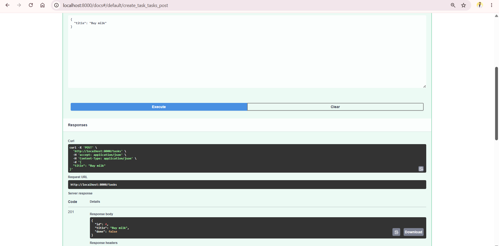
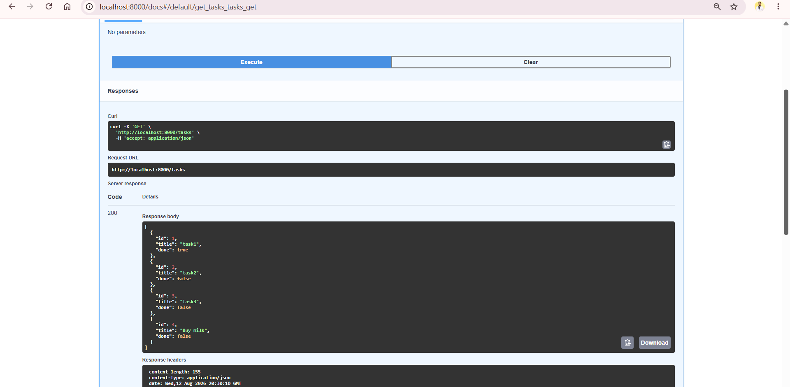
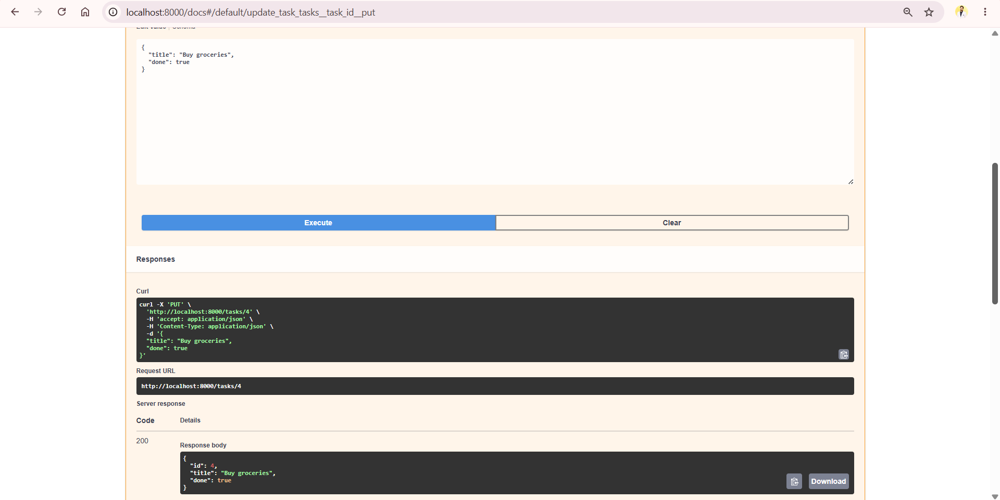
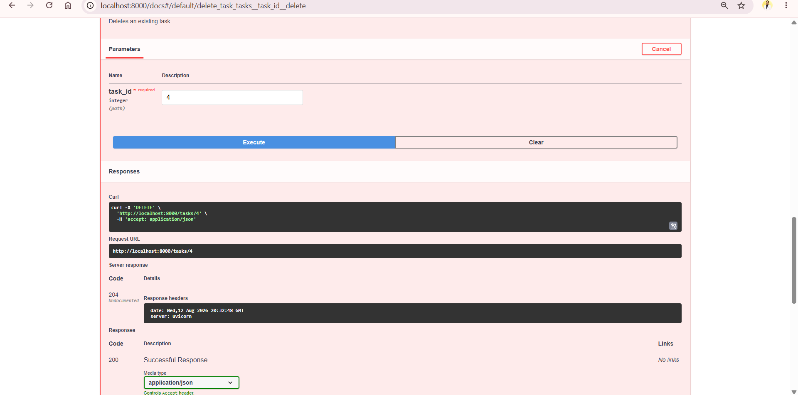

# Task API

A simple REST API built with **FastAPI** as part of the **FlyRank AI Internship Program — Week 2**.

The project demonstrates the fundamentals of building a backend API, including CRUD operations, path parameters, request bodies, validation, HTTP status codes, error handling, and Swagger UI documentation.

---

## Tech Stack

- Python
- FastAPI
- Uvicorn

---

## Features

- API root endpoint
- Health check endpoint
- List all tasks
- Get a single task by ID
- Create a new task
- Update an existing task
- Delete a task
- Request validation
- 404 error handling
- Appropriate HTTP status codes
- Interactive Swagger UI documentation

---

## Project Structure

```text
Week_2/
│
├── main.py
├── README.md
└── screenshots/
    ├── swagger-post.png
    ├── swagger-get.png
    ├── swagger-put.png
    └── swagger-delete.png
```

---

## Installation

Make sure Python is installed on your system.

Install FastAPI and Uvicorn:

```bash
pip install fastapi uvicorn
```

---

## Running the API

From the `Week_2` directory, run:

```bash
uvicorn main:app --reload
```

The API will be available at:

```text
http://localhost:8000
```

---

## Swagger UI

FastAPI automatically generates interactive API documentation.

Open:

```text
http://localhost:8000/docs
```

Swagger UI can be used to test all CRUD operations without using curl.

---

## API Endpoints

| Method | Endpoint | Description | Success Status |
|---|---|---|---|
| GET | `/` | Returns information about the API | 200 |
| GET | `/health` | Checks whether the API is running | 200 |
| GET | `/tasks` | Returns all tasks | 200 |
| GET | `/tasks/{task_id}` | Returns a single task by ID | 200 |
| POST | `/tasks` | Creates a new task | 201 |
| PUT | `/tasks/{task_id}` | Updates an existing task | 200 |
| DELETE | `/tasks/{task_id}` | Deletes a task | 204 |

---

## Example Task

A task contains:

```json
{
  "id": 1,
  "title": "task1",
  "done": true
}
```

---

## Creating a Task

### Request

```http
POST /tasks
```

Request body:

```json
{
  "title": "Buy milk"
}
```

The API automatically generates the task ID and sets `done` to `false`.

### Example Response

```json
{
  "id": 4,
  "title": "Buy milk",
  "done": false
}
```

Status:

```text
201 Created
```

---

## Updating a Task

### Request

```http
PUT /tasks/4
```

Request body:

```json
{
  "title": "Buy groceries",
  "done": true
}
```

Example response:

```json
{
  "id": 4,
  "title": "Buy groceries",
  "done": true
}
```

Status:

```text
200 OK
```

---

## Deleting a Task

### Request

```http
DELETE /tasks/4
```

Successful deletion returns:

```text
204 No Content
```

The response intentionally has no body.

---

## Error Handling

If a task does not exist, the API returns:

```text
404 Not Found
```

Example:

```json
{
  "error": "Task 99 not found"
}
```

If a new task is submitted without a valid title, the API returns:

```text
400 Bad Request
```

Example:

```json
{
  "error": "title is required and cannot be empty"
}
```

---

## curl Testing

### Get a single task

```bash
curl -i http://localhost:8000/tasks/1
```

Example successful response:

```text
HTTP/1.1 200 OK
content-type: application/json

{"id":1,"title":"task1","done":true}
```

### Request a task that does not exist

```bash
curl -i http://localhost:8000/tasks/99
```

Example response:

```text
HTTP/1.1 404 Not Found
content-type: application/json

{"error":"Task 99 not found"}
```

---

## Swagger Screenshots

### POST /tasks



### GET /tasks



### PUT /tasks/{task_id}



### DELETE /tasks/{task_id}



---

## Important Note

This project uses an **in-memory Python list** instead of a database.

Therefore, tasks are stored only while the server is running. Restarting the server resets the task list to the original example tasks.

This demonstrates the difference between temporary in-memory storage and persistent database storage.

---

## Learning Outcomes

Through this project, I practiced:

- Creating a FastAPI application
- Creating GET, POST, PUT, and DELETE endpoints
- Using path parameters
- Receiving JSON request bodies
- Validating client input
- Returning appropriate HTTP status codes
- Handling 404 errors
- Working with an in-memory data store
- Testing APIs with curl
- Testing APIs using Swagger UI
- Documenting an API with Markdown
- Using Git for stage-by-stage development

---

## Internship

**FlyRank AI Internship Program — Week 2**

Project: **Task API**
